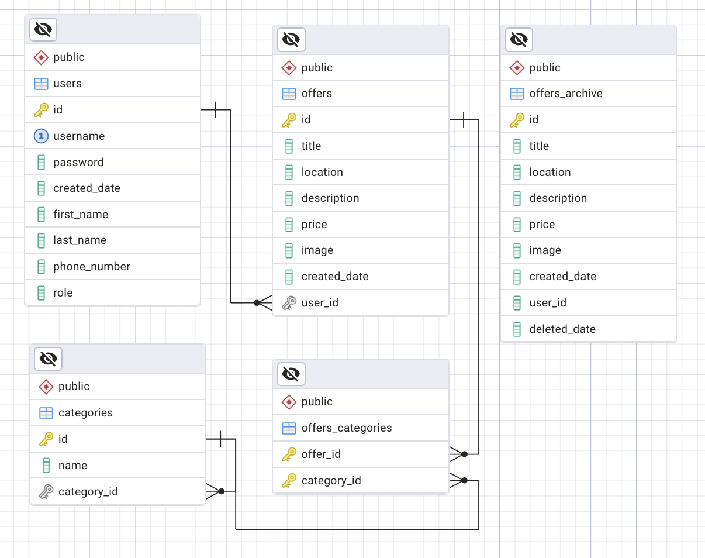
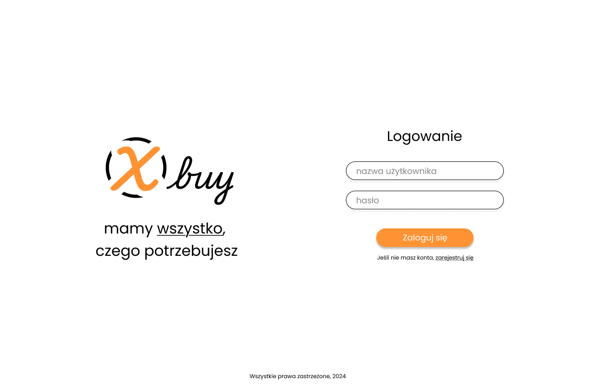
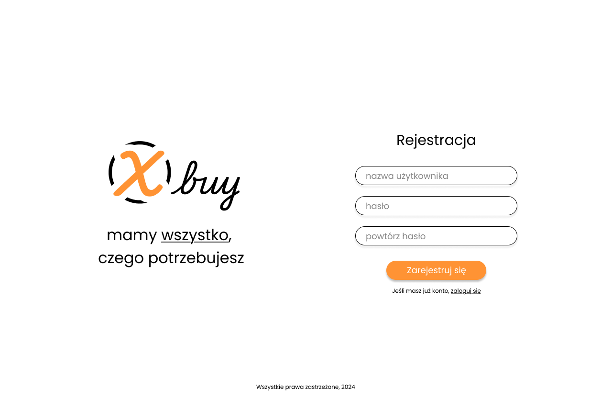
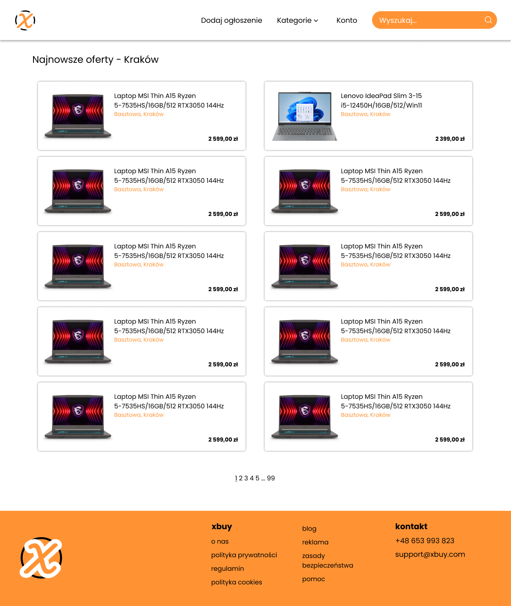
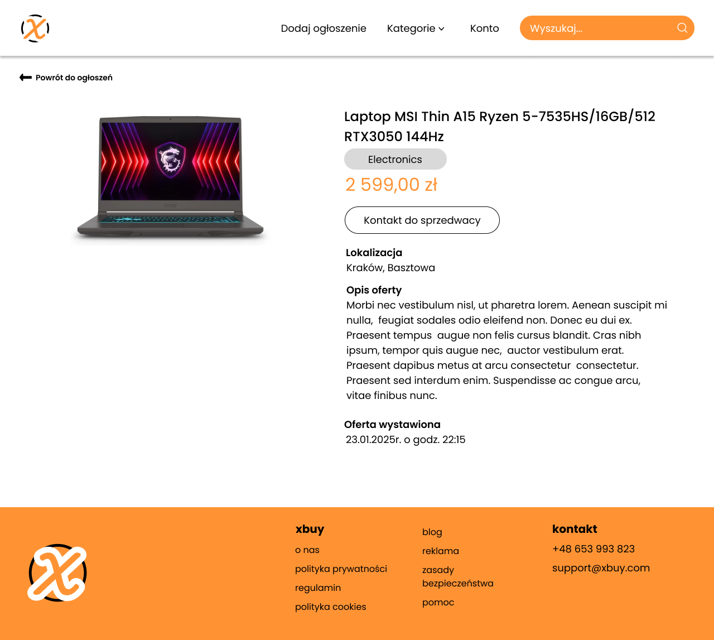
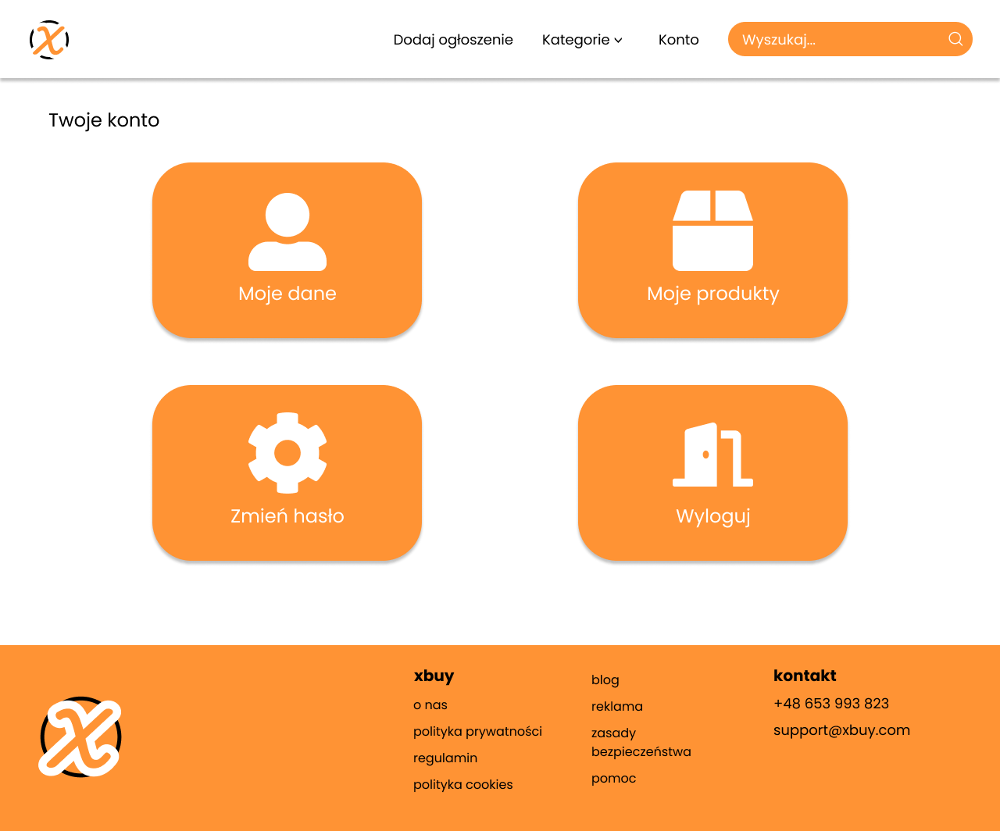
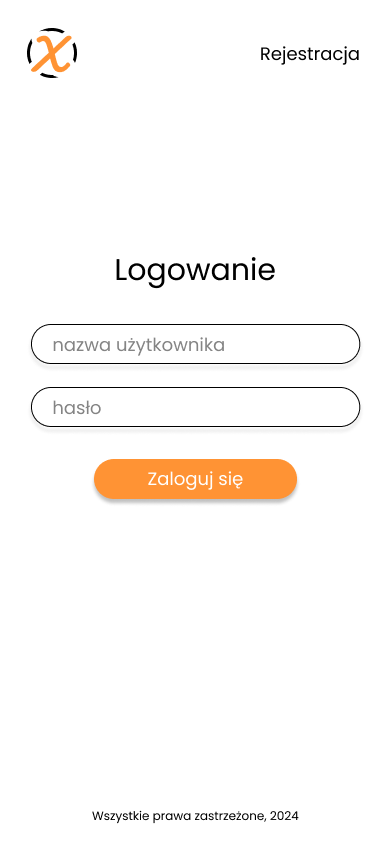
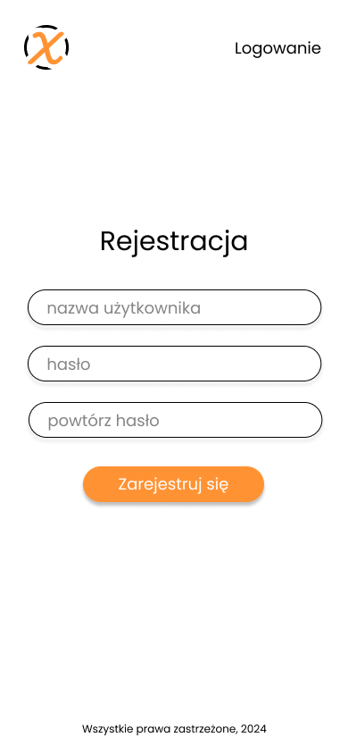
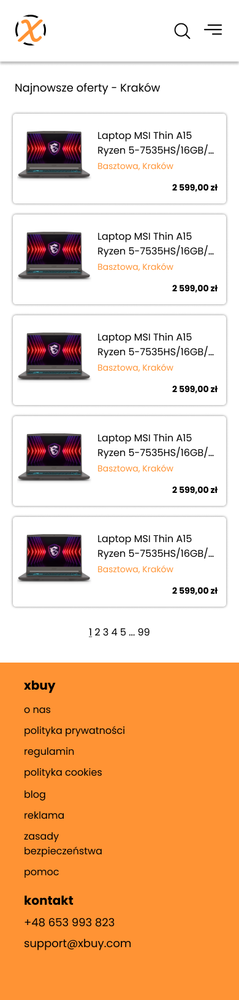

## XBuy
XBuy is a lightweight, class-based PHP application designed to provide a simple online marketplace where users (sellers) can register, log in, and create or search for offers. The app uses a PostgreSQL database for storing user and offer data and is served using Nginx.

## Setup
Clone the repository
```
git clone https://github.com/maxmarsz1/xbuy
```
run in project directory:
```
docker-compose up -d
```
Project will be available at [localhost:8080](http://localhost:8080)
and pgAdmin at [localhost:5050](http://localhost:5050)
Project already has some boilerplate data in the database
Password for admin user is `admin`

## ERD


## Prototypes

Below are some design prototypes for the XBuy application. These images provide a visual representation of the app's interface.











